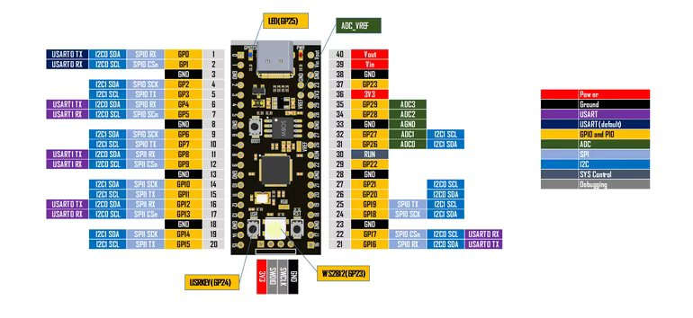
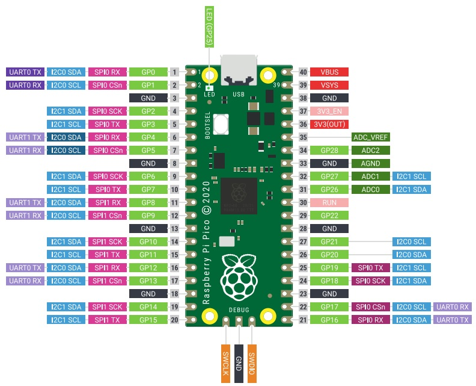
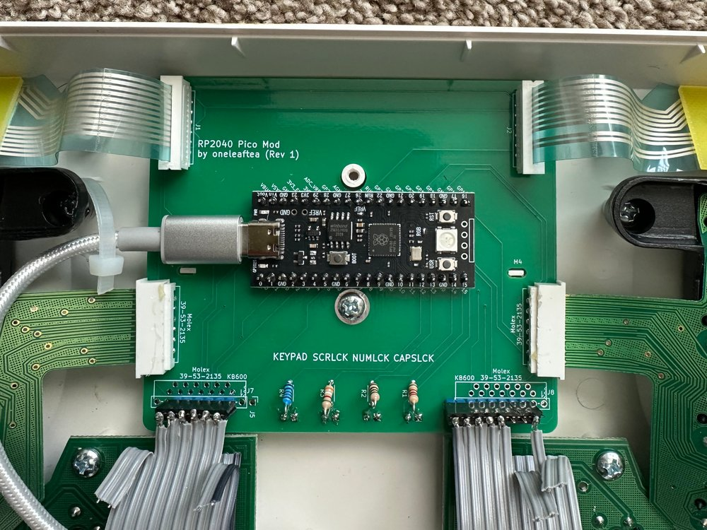
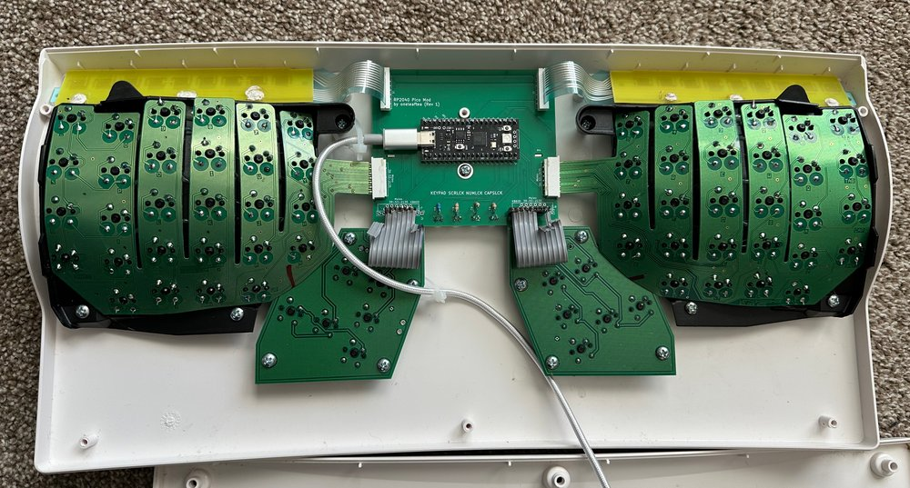
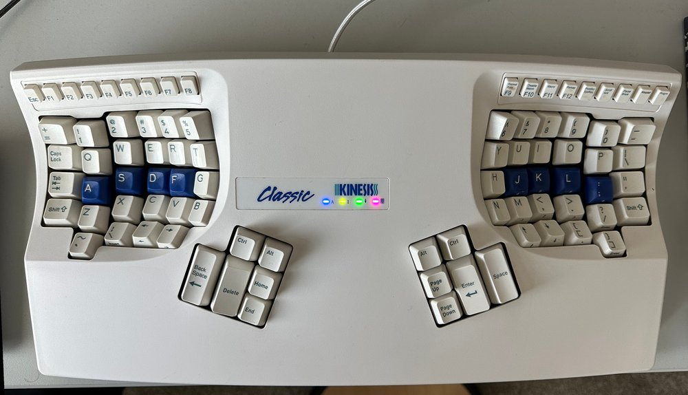

# RP2040 Pico Mod for the Kinesis Advantage Keyboard

This project includes the PCB design and the QMK default files for replacing a Kinesis Advantage/Contoured keyboard with a Raspberry Pi RP2040 Pico MCU.

## Attribution

Credit goes to Michael Stapelberg for the original KinT PCB as well as Ming-Gih Lam for developing several key changes:
 * Michael Stapelberg's [KinT project](https://github.com/kinx-project/kint) ([blog](https://michael.stapelberg.ch/posts/2020-07-09-kint-kinesis-keyboard-controller/))
 * Ming-Gih Lam's [pillzmod project](https://github.com/dcpedit/pillzmod)

The pillzmod version was especially useful in a few key changes. I borrowed the following:
 * Changing the KinT's usage of SMD LED's and resistors to use through-hole components.
 * Moving the main keywell FFC/FPC connectors and utilizing a combo footprint to be useable on later Advantage series (KB500 and KB600 variants utilizing the FFC cables) as well as older (Classic and Essential) Contoured series that connect directly to the board. 

## Note on MCU

I have built several of these boards using cheaper RP2040 MCU's from Tenstar Robot on Aliexpress, mainly due to the cheaper price as well as the USB-C connector. The pinout is the same as the official Raspberry Pi Pico, but as I have never used one, I can only vouch for it working with the Aliexpress ones (which are also available on Amazon). Just to be safe, I did not use GP23 and GP29, which are the two GPIO pins that are available on the Tenstar Robot version but not available on the official Raspberry Pi Pico.

Here is the pinout of the Tenstar Robot version:

Here is the pinout of the official version:

## Images of Final Build

